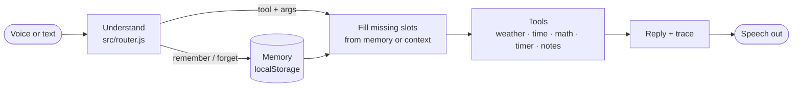

# Nova

**A context-aware voice assistant with memory and tool calling.** It runs entirely in your browser: no server, no account, nothing leaves your device except the weather lookup.

**[Try it live →](https://murtuzabuilds.github.io/nova/)** &nbsp;·&nbsp; [Case study](https://murtuzabuilds.com/#portfolio)

Nova started as a UX case study about one question: *what makes a voice assistant feel like it actually knows you?* This repo is the working answer. It's small on purpose, so every decision is visible.

## What it does

| You say | What Nova does | The idea it proves |
|---|---|---|
| "My name is Alex" · "I live in Madison" | Saves each fact to long-term memory | **Memory** that the user can see and edit |
| "What's the weather?" | Calls the weather tool, fills in *Madison* from memory | **Tool calling** with slots filled from memory |
| "And tomorrow?" | Reuses the city from the last turn | **Short-term context** for natural follow-ups |
| "Use celsius" | Changes how every later forecast is reported | Preferences that shape behavior |
| "Remember that the demo is Friday" | Saves a note, lists it back on request | Personal knowledge on demand |
| "Forget everything" | Wipes memory, instantly | **Control** sits with the user |

The right-hand **Trace** panel shows every decision as it happens: what Nova understood, what it filled from memory or context, which tool it called and what came back. Explainability is part of the interface, not a debug mode.

## Design principles

1. **Memory you can see is memory you can trust.** Everything Nova remembers is listed in the panel with a one-click forget. Nothing is inferred behind your back.
2. **Ask instead of guessing.** With no city in the request or in memory, Nova asks rather than defaulting to somewhere random.
3. **Follow-ups should just work.** "And tomorrow?" is how people talk. Short-term context carries the last tool call forward.
4. **Voice is a layer, not a requirement.** Speech in and out use the browser's own engines. Typing gives you everything voice does.
5. **Private by default.** Memory lives in `localStorage`. There's no backend to leak it.

## Architecture



```
src/
  router.js   intent understanding and slot filling (swap in an LLM here)
  memory.js   long-term Memory and short-term Context
  tools.js    weather (Open-Meteo), time, calculator, timers, notes
  nova.js     the assistant loop: understand → call tool → reply, with a trace
app.js        UI, speech recognition and synthesis, the particle orb
tests/        8 end-to-end conversations, run with node's built-in test runner
```

The router is rule-based so the demo is instant, free and deterministic. It sits behind one function, `route(text, { memory, context })`, so replacing it with an LLM that returns the same `{ kind, tool, args }` shape doesn't touch the rest of the app.

## Run it

```bash
git clone https://github.com/murtuzabuilds/nova && cd nova
npm test        # 8 tests, no dependencies
npm start       # serves the app locally
```

Voice input works in Chrome, Edge and Safari. Firefox falls back to typing.

## What I'd build next

- [ ] LLM router with the same interface, plus a confidence threshold that falls back to asking
- [ ] Memory with expiry, so "I'm in Chicago this week" fades on its own
- [ ] Calendar and email tools behind an approval step (see [handoff](https://github.com/murtuzabuilds/handoff) for the approval model)

---

Built by [Murtuza Mohammed](https://murtuzabuilds.com). MIT licensed.
